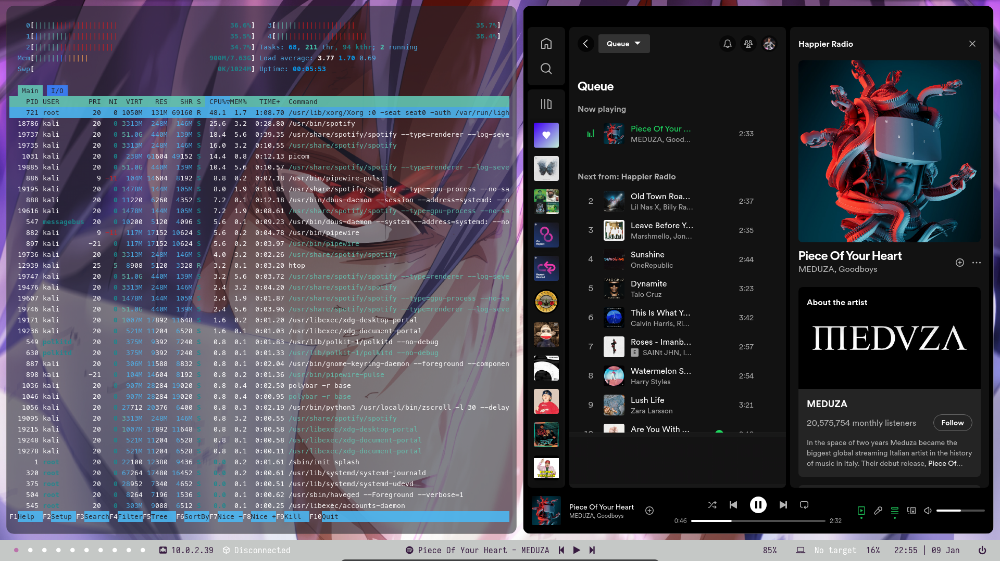

# kaliBSPWM

Este script de instalación automatiza la instalación de BSPWM, Picom y Polybar en un sistema operativo basado en Linux. El script está escrito en Bash y se llama install.sh.
**IMPORTANTE LEER TODO EL README.md**

## PREVIEW




## Requisitos previos

Antes de ejecutar este script, asegúrate de tener los siguientes requisitos previos instalados en tu sistema:

- **git**: necesario para clonar los repositorios de BSPWM, Picom y Polybar.
- Tener el controlador grafico en configuraciones **VBoxSVGA** para una correcta visualizacion. 

## Uso
Para ejecutar el script, sigue los siguientes pasos:

Clona el repositorio

```git clone https://github.com/JoaquinSM13/kaliBSPWM.git ```
```cd kaliBSPWM/```

Ejecuta el siguiente comando para dar permisos de ejecución al script
```chmod +x install.sh.```

Ejecuta el script con el siguiente comando: 

```./install.sh.```

Recomendaciones: 
- Cuando pregunta por el font, el font que yo he probado y funciona es el "MESLO"

## Funcionamiento del script

El script de instalación de BSPWM, Picom y Polybar funciona de la siguiente manera:

1. Clona los repositorios de BSPWM, Picom y Polybar de GitHub.
2. Compila e instala BSPWM, Picom y Polybar.
3. Configura BSPWM, Picom y Polybar para que se inicien automáticamente al iniciar sesión.

## Personalización de la configuración

Si deseas personalizar la configuración de BSPWM, Picom o Polybar, puedes hacerlo después de la instalación. Los archivos de configuración se encuentran en los siguientes directorios:

- **BSPWM:** ~/.config/bspwm/
- **Picom:** ~/.config/picom.conf
- **Polybar:** ~/.config/polybar/

## Contribución

Si encuentras algún problema o tienes alguna sugerencia de mejora, no dudes en abrir un issue o enviar un pull request en GitHub.
